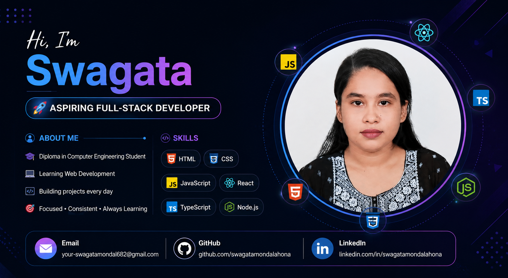

# Hi, I'm Swagata 👋

🚀 Aspiring Full-Stack Developer
## 👩‍💻 About Me

I'm an aspiring *Full-Stack Developer* currently pursuing a *Diploma in Computer Engineering*. I’m passionate about building modern, responsive, and user-friendly web applications.

I enjoy learning new technologies, solving programming problems, and turning ideas into real-world projects. I'm continuously improving my development skills through hands-on practice and personal projects.

🚀 Currently, I'm focusing on *JavaScript, TypeScript, React, Tailwind CSS*, and modern web development.
## 🚀 Currently

- 🌱 Exploring React and TypeScript
- 💻 Building responsive web projects
- 🔨 Working on a tourism website
- 📚 Practicing JavaScript problem solving
- 🎯 Preparing myself for a Full-Stack Developer career

## 🛠️ Skills

### Frontend

  

<h3>🛠️ Tools</h3>

  

<h2>🌐 Connect With Me</h2>

## 📊 GitHub Stats

  
  

  

